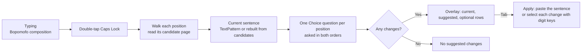

# Jevboard

[繁體中文](README.md) ・ English

Jevboard is a Windows tray utility that uses [Jev](https://docs.typesafe.ai/) to re-pick homophones in a sentence that Microsoft Bopomofo has not yet committed. It is a proof of concept (POC).

You type with Microsoft Bopomofo as usual and double-tap Caps Lock before pressing Enter. Jevboard reads the candidates the IME offers at each position, asks Jev which positions are wrong, and lists the suggestions in an overlay next to the cursor. Press Tab to apply or Esc to cancel.


```
IME result:  想在去一次芮氏
Suggestion:  想【再】去一次【瑞士】
```

The user interface is in Traditional Chinese, and the design notes in `docs/` are in Chinese.

## Contents

- [Background](#background)
- [Scope and limitations](#scope-and-limitations)
- [Features](#features)
- [Requirements](#requirements)
- [Installation](#installation)
- [Usage](#usage)
- [How it works](#how-it-works)
- [Tests and evaluation](#tests-and-evaluation)
- [Project layout](#project-layout)
- [Data, privacy, and security](#data-privacy-and-security)
- [Known limitations](#known-limitations)
- [Troubleshooting](#troubleshooting)
- [License](#license)

## Background

Microsoft Bopomofo converts a sentence using only local context, so it often picks the wrong homophone in pairs such as 在／再, 的／得, and 戴／帶. Jevboard adds a second pass after the IME conversion that judges the whole sentence. It chooses only among the words the IME itself lists and never introduces a character outside that list.

Jev is a decision API for multiple-choice questions. It returns a probability for each option, which fits the requirement of choosing from a fixed candidate list. How well Jev handles Chinese homophones is the question this POC tests. The results are in [docs/evaluation.md](docs/evaluation.md).

## Scope and limitations

Jevboard runs on top of Microsoft Bopomofo. It is not an IME of its own. A native IME can read its composition and candidates internally, but an external program cannot. Jevboard has to open the candidate window at each position with the IME's own keys and read the candidates through UI Automation. Applying a change works the same way, by reopening the candidate window and pressing a digit key. Every request walks the whole sentence at about 0.1 s per character, so longer sentences take longer, and the candidate window flickers during the walk.

This project is a proof of concept. Its goal is to show that re-selecting a whole sentence by meaning, while choosing only among the IME's own candidates, works in practice. It is not meant as a daily-use product. To be efficient, this process belongs inside the IME itself. I hope a future Bopomofo IME built natively on TSF adopts a similar approach.

## Features

- The IME stays in place. Every selection is made through Microsoft Bopomofo's own candidates and digit keys, so the IME's user learning keeps working.
- Whole-sentence judgment. Jevboard reads the candidates at every position, including multi-character words, builds one question per position, and sends them in a single request. If a sentence has several wrong characters, it runs more rounds. When two adjacent characters only make sense if both change, it compares them as a pair.
- Graded suggestions. High-confidence changes are selected by default. Other plausible candidates are listed as optional and are not selected.
- The overlay does not take focus. Showing or clicking it keeps focus in the input field, and pressing any other key or switching windows cancels it.
- Tested applications are native Win32 edit controls, Edge, VS Code, Obsidian, and the Claude desktop app. Jevboard finds the candidate window through UI Automation events, not screen coordinates. Other applications have not been tested.

## Requirements

| Item | Requirement |
| --- | --- |
| Operating system | Windows 10 or 11, x64 (developed on Windows 11 26200) |
| IME | Microsoft Bopomofo, built into Windows (TSF version) |
| Runtime | .NET Framework 4.8, built into Windows 10 and 11 |
| Build tool | `csc.exe`, built into Windows (`C:\Windows\Microsoft.NET\Framework64\v4.0.30319`). Visual Studio and the .NET SDK are not needed. |
| External service | A Jev API key ([how to get one](https://console.typesafe.ai/home)). The model is `jev-latest`. |

## Installation

### 1. Get the source and build

```bash
git clone git@github.com:AsheeHuang/Jevboard.git
cd Jevboard
powershell -NoProfile -ExecutionPolicy Bypass -File build.ps1
```

A successful build prints the path to `bin\Jevboard.exe`. The build uses only the compiler and assemblies that ship with Windows (WinForms, UIAutomationClient, System.Web.Extensions). There are no NuGet dependencies, so it builds offline.

### 2. First-time setup

1. Run `bin\Jevboard.exe`. It has no main window and shows only a tray icon. The executable is unsigned, so SmartScreen may warn on first run.
2. Right-click the tray icon, choose 設定… (Settings), paste your Jev API key, check 啟用 Caps Lock 雙擊 (enable Caps Lock double-tap), and click 儲存 (Save). Jevboard encrypts the key with Windows DPAPI in user scope and never writes it to the log.
3. The 啟用 (Enabled) item in the tray menu pauses or resumes Jevboard, and 結束 (Exit) closes it. Only one instance can run at a time.

### 3. Check that it works

1. Open Notepad, Edge, or any other program that accepts text, and switch Microsoft Bopomofo to Chinese mode.
2. Type a sentence with a wrong homophone, such as `我想在去一次瑞士`. Do not press Enter.
3. Press Caps Lock twice within 350 ms. After about one second, the overlay appears next to the candidate window. Press Tab to apply or Esc to cancel.
4. If nothing happens, check the last lines of `%LOCALAPPDATA%\Jevboard\jevboard.log` and see [Troubleshooting](#troubleshooting).

### 4. Start at sign-in (optional)

Press Win+R, enter `shell:startup`, and create a shortcut to `bin\Jevboard.exe` in the folder that opens.

### 5. Update and uninstall

To update, exit Jevboard from the tray, then run `git pull` and `build.ps1`. The build cannot overwrite the executable while it is running.

To uninstall, exit Jevboard from the tray and delete the repository folder and `%LOCALAPPDATA%\Jevboard`. The key, the enabled setting, and the log are stored only in that folder.

## Usage

| Key | When | Action |
| --- | --- | --- |
| Caps Lock twice | While composing (before Enter) | Read the sentence and send it to Jev |
| Tab | While the overlay shows suggestions | Apply all selected changes |
| 1 to 9 (main row or numpad) | While the overlay shows suggestions | Toggle that row. Candidates at the same position are mutually exclusive. |
| Esc | While the overlay is shown | Close the overlay without changes |
| Any other key, switching windows, clicking elsewhere | While the overlay is shown or reading is in progress | Cancel. The key goes to the IME as usual. |
| Caps Lock once | Any time | Toggles Chinese and English after 350 ms. The delay is how Jevboard detects a second press. |

The overlay shows the following:

- The 目前 (Current) line is the IME's current conversion.
- In the 建議 (Suggested) line, characters that will change have a blue background. A position with optional candidates has an amber dotted underline under the original character, followed by its row number (for example 依²).
- Each row below is one change and shows the position, the original character, the suggested character, and Jev's probability. A filled badge means the change will be applied. An outlined badge means it is optional.
- The title shows the number of changes, for example 「Jev 建議修改 2 處，另有 1 個可選」 (Jev suggests 2 changes, 1 optional) or 「Jev 沒有建議修改」 (Jev suggests no changes).

If the IME is in English mode, Jevboard switches it to Chinese after the double-tap and leaves it in Chinese mode when done. Spaces, punctuation, and English text in the sentence do not affect position counting.

## How it works



1. Detect the double-tap. A low-level keyboard hook requires two complete press-and-release cycles and ignores a held key. A single press is replayed unchanged after 350 ms.
2. Walk the composition. Jevboard moves through the sentence with the IME's own keys (Esc, Home, ↓, →, End, ←) and reads the first candidate page at each position with three cross-process UIA calls, about 0.1 s per character.
3. Get the current sentence. Editors that support UIA TextPattern (Chromium, Electron, WPF) expose the text before the cursor directly. Native EDIT controls do not expose an uncommitted composition, so Jevboard rebuilds the sentence from the first candidate at each position.
4. Ask Jev. All questions go out in one HTTP request to `/v1/systemone`. Each option is the whole sentence with that position replaced. Jev favors the first option when options are close, so each question is also asked in reverse order and the two distributions are averaged. A change is selected by default when its probability is at least 0.5 and at least twice that of keeping the original. Weaker alternatives are listed but not selected. Rounds repeat while new changes appear, and adjacent pairs are tried together when no single change passes.
5. Apply. If the current sentence was read directly, Jevboard cancels the composition with Esc and pastes the whole sentence. Otherwise it reopens the candidate window at each changed position, finds the target character, and presses its digit key, which leaves the composition uncommitted.

The Microsoft Bopomofo candidate window lives in the Windows immersive IME z-band. The `EnumWindows` family of APIs cannot list it, and only `WindowFromPoint` can reach it. Jevboard subscribes to the UI Automation StructureChanged event instead and gets the window's HWND each time it opens.

[docs/how-it-works.md](docs/how-it-works.md) covers the full flow, the reason for each step, and a real trace of one sentence. [docs/prompt-design.md](docs/prompt-design.md) covers the prompt wording, the decision rules, and approaches that were tried and dropped. Both are in Chinese.

## Tests and evaluation

All tests are static. They do not touch the keyboard, the IME, or any window.

```bash
powershell -NoProfile -ExecutionPolicy Bypass -File tests\run-tests.ps1          # unit tests, about 180
powershell -NoProfile -ExecutionPolicy Bypass -File tests\run-tests.ps1 -Live    # also run the 111-sentence live evaluation (needs a saved key)
powershell -NoProfile -ExecutionPolicy Bypass -File tests\run-tests.ps1 -Whole   # whole-sentence cases only, printing each prompt and response
bin\Jevboard.Tests.exe --preview                                                 # draw the overlay from fake data for 1.5 s and save bin\overlay-preview.png
```

The unit test fixtures are candidate pages recorded from Microsoft Bopomofo and Jev response payloads. They cover sentence reconstruction, question building, response parsing, selection rules, multi-round iteration, adjacent-pair comparison, key handling, and overlay text.

In the latest evaluation, Jevboard corrected 100 of 111 sentences that contained a wrong homophone and left 109 of 111 correct sentences unchanged. [docs/evaluation.md](docs/evaluation.md) describes the dataset, the scoring, the latest results, and the known failures.

## Project layout

```
Jevboard/
├── build.ps1                 Builds bin\Jevboard.exe with csc.exe, no SDK needed
├── src/
│   ├── Program.cs            Tray, settings, flow control, questions, and selection rules
│   ├── Hotkey.cs             Low-level keyboard hook: double-tap detection, replay, overlay keys
│   ├── Candidates.cs         Candidate window detection, composition walk, current sentence, apply
│   ├── JevClient.cs          Jev /v1/systemone requests and response validation
│   ├── Overlay.cs            Self-drawn overlay that does not take focus
│   ├── NativeUia.cs          Minimal native COM IUIAutomation interface for event subscription
│   └── Native.cs             Win32 P/Invoke
├── tests/
│   ├── JevboardTests.cs      Unit tests, live evaluation set, overlay preview
│   └── run-tests.ps1
└── docs/
    ├── how-it-works.md       How it works, with a full trace example
    ├── prompt-design.md      Jev prompt and decision rules
    ├── evaluation.md         Evaluation method, results, and known failures
    └── overlay-preview.png
```

## Data, privacy, and security

The keyboard hook handles only Caps Lock and the keys pressed while the overlay is shown. It does not record what you type.

Each double-tap sends the following over HTTPS to `api.typesafe.ai`. Nothing else is uploaded.

- The sentence being composed (the IME's conversion)
- The candidates at each position
- Up to 40 characters of committed text before the cursor, as context

The log at `%LOCALAPPDATA%\Jevboard\jevboard.log` records only events, generation numbers, candidate ids and probabilities, and window class names. It never records the key, the sentence, or candidate text.

The key is stored in `%LOCALAPPDATA%\Jevboard\key.bin`, encrypted with Windows DPAPI in user scope. Only the same Windows account can decrypt it.

Every key that Jevboard sends carries a marker, and the hook passes those keys through instead of treating them as user input. Jevboard sends Esc only while the candidate list is open, because Esc cancels the whole composition when the list is closed. Applying by paste uses the clipboard briefly and then restores its previous text. If the clipboard held non-text content such as an image, that content is not restored.

## Known limitations

- Jev makes mistakes. Probabilities vary widely for short sentences or sentences with little context. Proper nouns (such as 羅密歐), sentences about the characters themselves (such as 在再不分), and collocation preferences (such as changing 帶太陽眼鏡 to 戴) are common errors. The default threshold is strict and only high-confidence changes are selected, but wrong suggestions still appear. Review them before applying.
- Jevboard reads only the first candidate page, which holds up to nine candidates. If the correct character is on a later page, Jevboard cannot fix it. Paging is not implemented yet.
- In native EDIT controls, the current sentence is rebuilt. The candidate list is sorted by frequency while the IME converts by context, so the two sometimes disagree, and characters you changed by hand are not visible. Applying works per character and is not affected.
- The candidate window flickers at each position during the walk, about 0.1 s per character plus 0.12 s for spaces, punctuation, and English. Typing during the walk cancels it.
- If you double-tap when nothing is being composed, Jevboard sends an extra ↓ to the active application, and Home and End when needed.
- Applying by paste commits the sentence, so the IME does not learn from the correction. Applying with digit keys leaves the composition uncommitted.

## Troubleshooting

| Symptom | Likely cause |
| --- | --- |
| Double-tap does nothing | Check the log for `caps lock passed through: …`. `IME closed` means the IME is off in that window. `keyboard layout 0x0409` means the active layout is English. No log entry means Jevboard is not running or not enabled. |
| 沒有偵測到注音組字 (no Bopomofo composition detected) | There was no uncommitted composition (Enter was already pressed), or the IME does not offer candidates in that field. |
| 輸入法還在英數模式 (IME is still in English mode) | Jevboard sent Caps Lock and Shift but could not switch back to Chinese. Switch to Chinese by hand and double-tap again. |
| AI 暫不可用（http 401） (AI unavailable) | The key is wrong or expired. Enter it again under 設定… (Settings) in the tray menu. |
| The suggested sentence differs from the current one, but nothing was wrong | In native EDIT controls the current sentence is rebuilt and may not match what is on screen. Applying works per character and does not apply the wrong change. |
| The build cannot find csc.exe | You need .NET Framework 4.x, built into Windows, at `C:\Windows\Microsoft.NET\Framework64\v4.0.30319\csc.exe`. |

## License

[MIT](LICENSE). Jev and Microsoft Bopomofo belong to their respective owners. This project is not affiliated with either.
