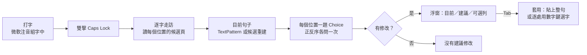

# Jevboard

微軟注音打出來的句子，交給 Jev 重新選字。

你照常用微軟注音打字。一句打完、還沒按 Enter 的時候，連按兩下 Caps Lock，Jevboard 會把這句話每個位置的候選字讀出來，問 [Jev](https://docs.typesafe.ai/) 哪些同音字選錯了，然後在游標旁邊開一個小浮窗給你看建議。看一眼，按 Tab 就套用，按 Esc 就當沒這回事。


```
輸入法轉出來的：想在去一次芮氏
Jev 建議：      想【再】去一次【瑞士】
```

這是一個概念驗證。能用，但還有不少毛病，後面會老實講。

[English summary](#english-summary) ・ [安裝](#安裝) ・ [怎麼用](#怎麼用) ・ [運作原理](docs/how-it-works.md) ・ [Prompt 怎麼下](docs/prompt-design.md) ・ [評估結果](docs/evaluation.md)

## 目錄

- [為什麼做這個](#為什麼做這個)
- [它做了什麼，沒做什麼](#它做了什麼沒做什麼)
- [English summary](#english-summary)
- [系統需求](#系統需求)
- [安裝](#安裝)
- [怎麼用](#怎麼用)
- [它是怎麼運作的](#它是怎麼運作的)
- [測試與評估](#測試與評估)
- [專案結構](#專案結構)
- [資料、隱私與安全](#資料隱私與安全)
- [做不好的地方](#做不好的地方)
- [出問題的時候](#出問題的時候)
- [這個專案怎麼來的](#這個專案怎麼來的)
- [授權](#授權)

## 為什麼做這個

注音打快一點，同音字就會選錯。在／再、的／得、戴／帶這種，打完回頭看才發現，而且輸入法自己的模型只看前後幾個字，常常判斷不出來。我想試的是另一條路：先讓輸入法照常轉換，打完再把整句丟給一個看得懂語意的模型做第二次選字，但只准它從輸入法本來就列出來的候選裡挑，不讓它自由發揮。

選 Jev 的原因很單純。它只做「固定選項裡選一個」這種決策，回的是每個選項的機率，不會生出清單以外的字。這剛好符合「不能亂改」的前提。至於它中文到底行不行，做之前我也不知道，所以才叫概念驗證。

## 它做了什麼，沒做什麼

輸入法不用換，這是整個專案的前提。所有選字最後都是用輸入法自己的候選和數字鍵完成的，輸入法該學的照樣會學。

它看的是整句，不是一個字。程式會自動逐字讀取輸入法在每個位置列出來的候選（多字詞也會讀到），每個位置出一題，一次問完。一句裡有好幾個錯字時會多問幾輪；兩個相鄰的字一起錯、單獨換哪一個都不像話的那種情況，也有特別處理。

建議分輕重：Jev 很有把握的修改預設就勾起來，次要的候選也列出來但預設不改。建議句會直接標出哪些字要換、哪些字可以換，數字鍵切換，Tab 套用，Esc 取消。

浮窗不會搶焦點。它是一個不取得焦點的視窗，顯示或點擊都不會讓你離開正在打字的欄位，而且只要你按了別的鍵或切到別的視窗，它就自己收起來。

我試過的程式有原生 Win32 編輯框、Edge、VS Code、Obsidian、Claude 桌面版。候選窗的位置是靠 UI Automation 的事件拿到的，不是算螢幕座標，所以理論上其他程式也行，但我沒有一一試過，不敢保證。

它不碰輸入法以外的任何來源，也不會替你按 Enter。候選只讀第一頁，這個是還沒做，不是不做。

## English summary

I built Jevboard because Microsoft Bopomofo keeps picking the wrong homophone when I type fast, and its own language model only looks a few characters around each position. Jevboard leaves the IME alone and adds a second pass: after you type a sentence and before you commit it, you double-tap Caps Lock, and the tool asks [Jev](https://docs.typesafe.ai/) which homophones to swap, choosing only among the candidates the IME itself offers.

Under the hood, the tool walks the uncommitted composition with the IME's own navigation keys and reads, through UI Automation, the candidate page the IME shows at every character. It then sends one request to Jev's `/v1/systemone` endpoint with one Choice question per position, where every option is the whole sentence with that position swapped for a candidate. Along the way I found that Jev penalises whichever option comes first when the options are close, so each question is also asked with its options reversed and the two distributions are averaged. A change is proposed by default when it reaches a probability of 0.5 and at least twice the probability of keeping the sentence; weaker alternatives are listed but switched off. Rounds repeat while new changes appear, and adjacent pairs are tried together when nothing passes alone.

The overlay never takes focus. Tab applies, the digits 1 to 9 toggle a row, Esc cancels. Applying either pastes the corrected sentence (when the editor exposes the composition through UIA TextPattern) or re-selects each change with the IME's own digit keys, in which case the composition stays uncommitted.

You need Windows 10 or 11 (x64), Microsoft Bopomofo, the C# compiler that ships with the .NET Framework (no SDK to install), and a Jev API key. Build with `powershell -NoProfile -ExecutionPolicy Bypass -File build.ps1`, run the static tests with `tests\run-tests.ps1`, and the live evaluation on 111 sentences with `tests\run-tests.ps1 -Live`. On the latest run it fixed 100 of 111 sentences that started with a wrong homophone and left 109 of 111 correct sentences alone. The weak spots are listed under [做不好的地方](#做不好的地方); the longer design notes in `docs/` are in Chinese.

## 系統需求

| 項目 | 需求 |
|---|---|
| 作業系統 | Windows 10 / 11，x64（我是在 Windows 11 26200 上做的） |
| 輸入法 | Windows 內建的微軟注音（TSF 版） |
| 執行環境 | .NET Framework 4.8，Windows 10/11 都內建 |
| 建置工具 | Windows 內建的 `csc.exe`（在 `C:\Windows\Microsoft.NET\Framework64\v4.0.30319`），不用裝 Visual Studio 或 .NET SDK |
| 服務 | 一把 Jev API key（[申請方式](https://docs.typesafe.ai/introduction/quickstart)），模型用 `jev-latest` |

## 安裝

### 1. 取得原始碼並建置

```bash
git clone <this-repo-url> Jevboard
cd Jevboard
powershell -NoProfile -ExecutionPolicy Bypass -File build.ps1
```

成功的話會印出 `bin\Jevboard.exe` 的路徑。建置只用 Windows 內建的編譯器和組件（WinForms、UIAutomationClient、System.Web.Extensions），沒有任何 NuGet 相依，所以離線也能建。

### 2. 第一次啟動

1. 執行 `bin\Jevboard.exe`。它沒有主視窗，只會在系統匣出現一個圖示。執行檔沒有簽章，第一次 SmartScreen 可能會跳警告。
2. 在系統匣圖示按右鍵，選「設定…」，把 Jev API key 貼進去（輸入時會遮罩），勾「啟用 Caps Lock 雙擊」，按「儲存」。key 用 Windows DPAPI 以你的帳號加密存起來，不會出現在日誌裡。
3. 之後想暫停就在系統匣選單點「啟用」取消勾選，「結束」會關掉程式。程式一次只能跑一個。

### 3. 試試看

1. 打開記事本、Edge 或任何可以打字的地方，切到微軟注音的中文模式。
2. 打一句裡面有同音字的話，例如 `我想在去一次瑞士`，不要按 Enter。
3. 350 毫秒內連按兩下 Caps Lock。大約一秒後浮窗會出現在候選窗旁邊。按 Tab 套用，或 Esc 取消。
4. 沒反應的話，開 `%LOCALAPPDATA%\Jevboard\jevboard.log` 看最後幾行，常見原因整理在[出問題的時候](#出問題的時候)。

### 4. 開機自動啟動（可選）

按 Win+R，輸入 `shell:startup`，在開出來的資料夾放一個指向 `bin\Jevboard.exe` 的捷徑。

### 5. 更新與移除

要更新，`git pull` 之後重新跑一次 `build.ps1` 就好。建置前要先從系統匣結束舊的實例，執行檔在跑的時候蓋不掉。

要移除，從系統匣「結束」，刪掉 repo 目錄，再刪 `%LOCALAPPDATA%\Jevboard`。key、啟用旗標、日誌都在那裡，別的地方沒有留東西。

## 怎麼用

| 按什麼 | 什麼時候 | 會怎樣 |
|---|---|---|
| Caps Lock 連按兩下 | 組字中（還沒按 Enter） | 開始讀整句、問 Jev |
| Tab | 浮窗顯示建議時 | 套用所有勾起來的修改 |
| 1 到 9（主鍵盤或數字鍵盤） | 浮窗顯示建議時 | 切換那一列要不要套用；同一個位置的候選互斥 |
| Esc | 浮窗顯示時 | 收起浮窗，一個字都不改 |
| 其他任何鍵、切窗、點別的地方 | 浮窗顯示或讀取中 | 取消這一次，你按的鍵照常送給輸入法 |
| Caps Lock 單按 | 任何時候 | 350 毫秒後照常切換中英。延遲是為了等看看有沒有第二下 |

浮窗怎麼讀：

「目前」那行是輸入法現在轉出來的句子。「建議」那行裡，會套用的字是藍底；有別的候選但預設不改的位置，原字底下有一條琥珀色的點狀底線，字後面標著列號，像是「依²」。所以就算建議句跟目前句一模一樣，也看得出哪些字可以換、該按哪個數字。下面每一列是一處修改：實心徽章代表會套用，空心代表可選；後面是第幾個字、原字、建議字、Jev 給的機率。標題會寫「Jev 建議修改 2 處，另有 1 個可選」或是「Jev 沒有建議修改」。

打完英文還留在英數模式也沒關係，雙擊之後程式會先切回中文再開始，結束後就停在中文模式。句子裡夾著空白、標點或英文，位置也都對得上。

## 它是怎麼運作的



先講一個我做之前不知道的事：微軟注音的候選窗躲在 Windows 沉浸式 IME 的 z-band 裡，`EnumWindows` 那一整族 API 都看不到它，只有 `WindowFromPoint` 戳得到。最後的解法是訂閱 UI Automation 的 StructureChanged 事件，候選窗每次打開都會帶著 HWND 冒出來。這件事卡了我不少時間。

流程本身是這樣的。低階鍵盤 hook 判斷你是不是真的連按兩下（兩次完整的按下放開、排除按住不放），單按的話 350 毫秒後原樣重播。確認是雙擊之後，程式用輸入法自己的鍵（Esc、Home、↓、→、End、←）把整句走一遍，每個位置用三次跨程序 UIA 呼叫讀第一頁候選，一個字大約 0.1 秒。接著決定「目前的句子」是什麼：有 UIA TextPattern 的編輯器（Chromium、Electron、WPF）直接讀游標前的文字；原生 EDIT 讀不到未定稿的組字，只能拿每個位置候選的第一項拼。然後一個 HTTP 請求送出所有題目，每題正序反序各問一次取平均，依門檻決定哪些要改、哪些列成可選。最後套用：目前句子是精確讀到的就 Esc 取消組字、整句貼上；不然就逐處重開候選，找到那個字按它的數字鍵。

細節、每一步的理由、還有一句話從頭到尾的真實追蹤，都在 [docs/how-it-works.md](docs/how-it-works.md)。Prompt 的措辭和每一條判斷規則，包括我試過哪些沒用的，在 [docs/prompt-design.md](docs/prompt-design.md)。

## 測試與評估

測試全部是靜態的：不碰鍵盤、不碰輸入法、不開視窗。

```bash
powershell -NoProfile -ExecutionPolicy Bypass -File tests\run-tests.ps1          # 單元測試，約 180 項
powershell -NoProfile -ExecutionPolicy Bypass -File tests\run-tests.ps1 -Live    # 再跑 111 句線上評估，需要已儲存的 key
powershell -NoProfile -ExecutionPolicy Bypass -File tests\run-tests.ps1 -Whole   # 只跑整句案例，把實際送出的 prompt 和回答印出來
bin\Jevboard.Tests.exe --preview                                                 # 用假資料把浮窗畫出來 1.5 秒，存成 bin\overlay-preview.png
```

單元測試的 fixture 是我從微軟注音錄下來的候選頁，加上 Jev 回應的格式，涵蓋句子重建、出題、回應解析、採用規則、迭代、相鄰成對比較、按鍵決策和浮窗文字。評估集怎麼組成、怎麼算、最新的數字、哪些句子就是做不好，都寫在 [docs/evaluation.md](docs/evaluation.md)。

## 專案結構

```
Jevboard/
├── build.ps1                 建置 bin\Jevboard.exe，用 csc.exe，不需要 SDK
├── src/
│   ├── Program.cs            系統匣、設定、流程控制、出題與採用規則
│   ├── Hotkey.cs             低階鍵盤 hook：雙擊判斷、重播、浮窗期間的按鍵
│   ├── Candidates.cs         找候選窗、逐字走訪、目前句子、套用
│   ├── JevClient.cs          Jev /v1/systemone 的請求與回應驗證
│   ├── Overlay.cs            不取得焦點的浮窗，自己畫的
│   ├── NativeUia.cs          最小的原生 COM IUIAutomation 介面，只用來訂事件
│   └── Native.cs             Win32 P/Invoke
├── tests/
│   ├── JevboardTests.cs      單元測試、線上評估集、浮窗預覽
│   └── run-tests.ps1
├── docs/
│   ├── how-it-works.md       運作原理，含完整追蹤範例
│   ├── prompt-design.md      給 Jev 的 prompt 和所有判斷規則
│   ├── evaluation.md         評估方法、結果、已知失敗
│   └── overlay-preview.png
├── diagnostics/              第一階段的可行性實驗和證據，當歷史紀錄留著
└── POC_SPEC.md               最初的規格
```

## 資料、隱私與安全

鍵盤 hook 平常只看 Caps Lock，還有浮窗開著的時候你按了什麼鍵。它不記錄你打的內容。

會送出去的東西只有三樣：你雙擊當下那一句（輸入法轉換的結果）、每個位置的候選字、游標前最多 40 個字的已定稿文字（當語境用）。走 HTTPS 到 `api.typesafe.ai`。沒有別的上傳。

日誌在 `%LOCALAPPDATA%\Jevboard\jevboard.log`，只記事件、世代序號、候選的 id 和機率、視窗的 class 名稱。key、句子、候選字都不會寫進去。

key 存在 `%LOCALAPPDATA%\Jevboard\key.bin`，Windows DPAPI 以使用者範圍加密，只有同一個 Windows 帳號讀得出來。

程式注入的每一個按鍵都帶標記，hook 看到就放行，不會把自己送的鍵當成你的操作。Esc 只在候選清單開著的時候送，因為清單沒開時 Esc 會把整句取消。貼上套用會短暫用到剪貼簿，貼完會把原本的文字放回去；如果原本是圖片之類的非文字內容，就還不回來了。

## 做不好的地方

Jev 的判斷有上限。短句、語境少的時候機率飄得厲害；專有名詞（羅密歐）、在談字本身的句子（「在再不分」）、搭配偏好（「出門要帶保險套」它硬要改成「戴」）這幾類它會錯。我能做的是把門檻設嚴一點，有把握的才預設改、其他的只列成可選，但錯的建議還是會出現。按 Tab 之前看一下。

候選只讀第一頁，最多九個，正確的字在第二頁以後就沒救。翻頁技術上做得到，我還沒做。

原生 EDIT 欄位的「目前句子」是重建的。這種欄位讀不到未定稿的組字，只能用每個位置候選的第一項拼。候選清單是照字頻排的，整句轉換是照語境，偶爾對不起來；你手動改過的字也看不到。套用的時候是以字為準，不受這個影響。

走訪的時候候選窗會一個字一個字地閃，一個字大約 0.1 秒，空白、標點、英文的位置再多等 0.12 秒。讀的時候請不要打字，打了就中斷。

沒有組字的時候雙擊，程式會多送一個 ↓（必要時再送 Home 和 End）給你正在用的程式。

貼上套用會把句子定稿，輸入法學不到這次修正；逐處選字那條路才會保持組字未提交。

## 出問題的時候

| 症狀 | 大概是什麼情況 |
|---|---|
| 雙擊沒反應 | 看日誌有沒有 `caps lock passed through: …`。`IME closed` 是那個視窗沒開輸入法；`keyboard layout 0x0409` 是現在在英文鍵盤；什麼都沒記就是程式沒在跑或沒啟用。 |
| 「沒有偵測到注音組字」 | 當時沒有未定稿的組字（已經按過 Enter），或者輸入法在那個欄位不給候選。 |
| 「輸入法還在英數模式」 | 程式送了 Caps Lock 和 Shift 都切不回中文。手動切回中文再雙擊。 |
| 「AI 暫不可用（http 401）」 | key 錯了或過期，到系統匣「設定…」重新貼。 |
| 建議句和目前句不同，但你明明沒打錯 | 原生 EDIT 的「目前」是重建的，可能跟實際不一樣。套用以字為準，不會因此套錯。 |
| 建置時找不到 csc.exe | 要有 Windows 內建的 .NET Framework 4.x，路徑是 `C:\Windows\Microsoft.NET\Framework64\v4.0.30319\csc.exe`。 |

## 這個專案怎麼來的

`POC_SPEC.md` 是最初的規格，當時打算只做單一位置的選字，不做整句，也不敢自動按 ↓。實際用起來發現單字選字沒什麼意思，自己按就好了，才改成整句重選、自動開候選、貼上套用。README 和 `docs/` 寫的是現在的行為，規格留著是給人看脈絡的。

`diagnostics/` 是第一階段的可行性實驗，用來回答幾個當時不確定的問題：外部程式讀不讀得到微軟注音的候選、能不能用數字鍵在原來的組字位置選字、IMM32 和 UIA TextEditPattern 在原生 EDIT 讀不讀得到未定稿的組字。答案分別是可以、可以、不行。`REPORT.md` 和 `evidence/` 是當時的證據，實驗程式和編譯好的小工具也留著。

## 授權

[MIT](LICENSE)。Jev 和微軟注音各是其所有者的產品，本專案與它們沒有關係。
