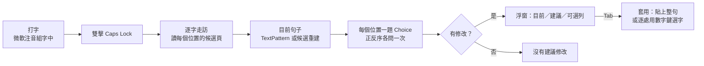

# Jevboard

繁體中文 ・ [English](README.en.md)

Jevboard 是一個 Windows 系統匣工具，用 [Jev](https://docs.typesafe.ai/) 為微軟注音尚未送出的整句重新選擇同音字。目前是概念驗證（POC）。

使用者照常以微軟注音輸入，在按 Enter 之前連按兩下 Caps Lock。Jevboard 讀取輸入法在每個字位提供的候選，請 Jev 判斷哪些位置選錯，並在游標旁的浮窗列出建議。按 Tab 套用，按 Esc 取消。


```
輸入法結果：想在去一次芮氏
建議結果：  想【再】去一次【瑞士】
```

## 目錄

- [背景](#背景)
- [定位與限制](#定位與限制)
- [功能](#功能)
- [系統需求](#系統需求)
- [安裝](#安裝)
- [使用方式](#使用方式)
- [運作原理](#運作原理)
- [測試與評估](#測試與評估)
- [專案結構](#專案結構)
- [資料、隱私與安全](#資料隱私與安全)
- [已知限制](#已知限制)
- [疑難排解](#疑難排解)
- [授權](#授權)

## 背景

微軟注音的整句轉換只參考局部語境，「在／再」「的／得」「戴／帶」這類同音字經常選錯。Jevboard 在輸入法轉換完成後，再以整句語意做一次選字。候選範圍限定在輸入法本身列出的字詞，不會產生清單以外的字。

Jev 是選擇題型的決策 API，對每個選項回傳機率，符合「只能從固定候選中挑選」的需求。Jev 處理中文同音字的準確度是這個 POC 要驗證的問題，結果記錄在 [docs/evaluation.md](docs/evaluation.md)。

## 定位與限制

Jevboard 建立在微軟注音之上，不是獨立的輸入法。原生輸入法可以在內部直接存取組字與候選，外部程式做不到，只能用輸入法自己的按鍵逐字開啟候選窗，再透過 UI Automation 讀取畫面上的候選。套用修改時也一樣，要重新開啟候選窗並按數字鍵選字。每次判斷都得把整句走過一遍，每字約 0.1 秒，句子越長越慢，候選窗也會在走訪時逐字閃動。

這個專案是概念驗證，目的是證明「只從輸入法提供的候選中挑選、以整句語意重新選字」這個做法可行，而不是做出日常使用的產品。若要達到實用的效率，這個流程應該實作在輸入法內部。希望未來能有基於原生架構（TSF）的注音輸入法採用類似的做法。

## 功能

- 不替換輸入法。所有選字最終都透過微軟注音自己的候選與數字鍵完成，輸入法的使用者學習照常運作。
- 整句判斷。程式逐字讀取每個位置的候選（含多字詞），每個位置一題，以單一請求送出。句中有多個錯字時會進行多輪；相鄰兩字必須同時替換才通順的情況，另以成對比較處理。
- 分級建議。高信心的修改預設勾選，其他合理候選列為「可選」，預設不套用。
- 浮窗不取得焦點。顯示與點擊都不會讓輸入欄位失去焦點，按下其他按鍵或切換視窗即自動取消。
- 已驗證的應用程式包括原生 Win32 編輯框、Edge、VS Code、Obsidian 與 Claude 桌面版。候選窗位置由 UI Automation 事件取得，不依賴螢幕座標。其他應用程式尚未逐一驗證。

## 系統需求

| 項目 | 需求 |
| --- | --- |
| 作業系統 | Windows 10 / 11，x64（開發環境為 Windows 11 26200） |
| 輸入法 | Windows 內建的微軟注音（TSF 版） |
| 執行環境 | .NET Framework 4.8（Windows 10/11 內建） |
| 建置工具 | Windows 內建的 `csc.exe`（`C:\Windows\Microsoft.NET\Framework64\v4.0.30319`），不需要 Visual Studio 或 .NET SDK |
| 外部服務 | Jev API key（[申請方式](https://console.typesafe.ai/home)），模型為 `jev-latest` |

## 安裝

### 1. 取得原始碼並建置

```bash
git clone git@github.com:AsheeHuang/Jevboard.git
cd Jevboard
powershell -NoProfile -ExecutionPolicy Bypass -File build.ps1
```

建置成功時會印出 `bin\Jevboard.exe` 的路徑。建置只使用 Windows 內建的編譯器與組件（WinForms、UIAutomationClient、System.Web.Extensions），沒有 NuGet 相依，可離線建置。

### 2. 首次設定

1. 執行 `bin\Jevboard.exe`。程式沒有主視窗，只在系統匣顯示圖示。執行檔未簽章，首次執行時 SmartScreen 可能顯示警告。
2. 在系統匣圖示上按右鍵，選「設定…」，貼上 Jev API key，按「儲存」。儲存 key 的同時會啟用 Jevboard。程式以 Windows DPAPI 的使用者範圍加密保存 key，日誌中不會出現 key。
3. 系統匣選單的「啟用」可暫停或恢復功能，「結束」關閉程式。同一時間只能執行一個實例。

### 3. 確認運作

1. 開啟記事本、Edge 或其他可輸入文字的程式，切換到微軟注音中文模式。
2. 輸入一句含同音字錯誤的句子，例如 `我想在去一次瑞士`，不要按 Enter。
3. 在 350 毫秒內連按兩下 Caps Lock。約一秒後，浮窗會出現在候選窗旁。按 Tab 套用，或按 Esc 取消。
4. 若沒有反應，請查看 `%LOCALAPPDATA%\Jevboard\jevboard.log` 的最後幾行，並參考[疑難排解](#疑難排解)。

### 4. 開機自動啟動（選用）

按 Win+R，輸入 `shell:startup`，在開啟的資料夾中建立指向 `bin\Jevboard.exe` 的捷徑。

### 5. 更新與移除

更新時，先從系統匣結束程式，再執行 `git pull` 與 `build.ps1`。程式執行中無法覆寫執行檔。

移除時，從系統匣結束程式，刪除 repo 目錄與 `%LOCALAPPDATA%\Jevboard`。key、啟用設定與日誌都只存放在該目錄。

## 使用方式

| 按鍵 | 時機 | 動作 |
| --- | --- | --- |
| Caps Lock 連按兩下 | 組字中（尚未按 Enter） | 讀取整句並送交 Jev |
| Tab | 浮窗顯示建議時 | 套用所有勾選的修改 |
| 1 到 9（主鍵盤或數字鍵盤） | 浮窗顯示建議時 | 切換該列是否套用。同一位置的候選互斥 |
| Esc | 浮窗顯示時 | 關閉浮窗，不做任何修改 |
| 其他按鍵、切換視窗、點擊其他位置 | 浮窗顯示或讀取中 | 取消本次操作，按鍵照常送交輸入法 |
| Caps Lock 單按 | 任何時候 | 350 毫秒後照常切換中英。延遲用於判斷是否有第二下 |

浮窗內容說明：

- 「目前」列是輸入法目前的轉換結果。
- 「建議」列中，將被套用的字以藍底標示。有其他候選但預設不改的位置，原字下方有琥珀色點狀底線，字後標註列號（例如「依²」）。
- 下方每一列代表一處修改，依序顯示字位、原字、建議字與 Jev 給出的機率。實心標記表示會套用，空心表示可選。
- 標題顯示修改數量，例如「Jev 建議修改 2 處，另有 1 個可選」或「Jev 沒有建議修改」。

輸入法停在英數模式時，程式會在雙擊後先切回中文，結束後維持中文模式。句中含空白、標點或英文時，字位計算不受影響。

## 運作原理



1. 偵測雙擊。低階鍵盤 hook 要求兩次完整的按下與放開，並排除長按。單按會在 350 毫秒後原樣重播。
2. 走訪組字。程式以輸入法的按鍵（Esc、Home、↓、→、End、←）逐字移動，每個位置以三次跨程序 UIA 呼叫讀取第一頁候選，每字約 0.1 秒。
3. 取得目前句子。支援 UIA TextPattern 的編輯器（Chromium、Electron、WPF）直接讀取游標前文字。原生 EDIT 無法讀取未定稿的組字，改以每個位置的第一候選重建。
4. 詢問 Jev。所有題目以單一 HTTP 請求送出，每題以正序與反序各問一次後取平均，再依門檻決定預設套用與可選的修改。
5. 套用。若目前句子是直接讀取的，程式以 Esc 取消組字並貼上整句。否則逐處重新開啟候選窗，找到目標字並按下對應的數字鍵。

微軟注音的候選窗位於 Windows 沉浸式 IME 的 z-band，`EnumWindows` 系列 API 無法列舉，只有 `WindowFromPoint` 能取得。Jevboard 改為訂閱 UI Automation 的 StructureChanged 事件，在候選窗開啟時取得其 HWND。

完整流程、各步驟的設計理由與一句話的實際追蹤紀錄，見 [docs/how-it-works.md](docs/how-it-works.md)。Prompt 措辭、判斷規則與試過但未採用的做法，見 [docs/prompt-design.md](docs/prompt-design.md)。

## 測試與評估

所有測試都是靜態的，不操作鍵盤、輸入法或視窗。

```bash
powershell -NoProfile -ExecutionPolicy Bypass -File tests\run-tests.ps1          # 單元測試，約 180 項
powershell -NoProfile -ExecutionPolicy Bypass -File tests\run-tests.ps1 -Live    # 加跑 111 句線上評估，需要已儲存的 key
powershell -NoProfile -ExecutionPolicy Bypass -File tests\run-tests.ps1 -Whole   # 只跑整句案例，印出送出的 prompt 與回應
bin\Jevboard.Tests.exe --preview                                                 # 以假資料繪製浮窗 1.5 秒，存成 bin\overlay-preview.png
```

單元測試的 fixture 是從微軟注音錄下的候選頁與 Jev 回應格式，涵蓋句子重建、出題、回應解析、採用規則、多輪迭代、相鄰成對比較、按鍵判斷與浮窗文字。

最新一次評估中，111 句含同音字錯誤的句子修正了 100 句，111 句原本正確的句子有 109 句維持不變。評估集的組成、計算方式、最新結果與已知失敗案例，見 [docs/evaluation.md](docs/evaluation.md)。

## 專案結構

```
Jevboard/
├── build.ps1                 以 csc.exe 建置 bin\Jevboard.exe，不需要 SDK
├── src/
│   ├── Program.cs            系統匣、設定、流程控制、出題與採用規則
│   ├── Hotkey.cs             低階鍵盤 hook：雙擊判斷、重播、浮窗期間的按鍵
│   ├── Candidates.cs         候選窗偵測、逐字走訪、目前句子、套用
│   ├── JevClient.cs          Jev /v1/systemone 的請求與回應驗證
│   ├── Overlay.cs            不取得焦點的自繪浮窗
│   ├── NativeUia.cs          訂閱事件用的最小原生 COM IUIAutomation 介面
│   └── Native.cs             Win32 P/Invoke
├── tests/
│   ├── JevboardTests.cs      單元測試、線上評估集、浮窗預覽
│   └── run-tests.ps1
└── docs/
    ├── how-it-works.md       運作原理與完整追蹤範例
    ├── prompt-design.md      Jev prompt 與判斷規則
    ├── evaluation.md         評估方法、結果與已知失敗
    └── overlay-preview.png
```

## 資料、隱私與安全

鍵盤 hook 平時只處理 Caps Lock，以及浮窗顯示期間的按鍵，不記錄輸入內容。

每次雙擊會以 HTTPS 傳送下列資料到 `api.typesafe.ai`，此外沒有其他上傳：

- 當下的組字句子（輸入法轉換結果）
- 每個位置的候選字
- 游標前最多 40 字的已定稿文字，作為語境

日誌位於 `%LOCALAPPDATA%\Jevboard\jevboard.log`，只記錄事件、世代序號、候選 id 與機率、視窗 class 名稱，不記錄 key、句子或候選字。

key 存於 `%LOCALAPPDATA%\Jevboard\key.bin`，以 Windows DPAPI 使用者範圍加密，只有同一個 Windows 帳號能解密。

程式送出的按鍵都帶有標記，hook 會直接放行，不會誤判為使用者操作。Esc 只在候選清單開啟時送出，因為清單未開時 Esc 會取消整句組字。貼上套用時會暫時使用剪貼簿，完成後還原原本的文字內容。若剪貼簿原本是圖片等非文字內容，則無法還原。

## 已知限制

- Jev 的判斷有誤差。短句或語境不足時機率波動大，專有名詞（如「羅密歐」）、討論字本身的句子（如「在再不分」）與搭配偏好（如將「帶太陽眼鏡」改為「戴」）容易判斷錯誤。預設門檻偏嚴，只有高信心的修改會預設勾選，但仍可能出現錯誤建議，套用前請確認。
- 只讀取第一頁候選，最多九個。正確字在第二頁以後時無法修正。翻頁尚未實作。
- 原生 EDIT 欄位的「目前句子」是重建的。候選清單依字頻排序，整句轉換依語境，兩者偶爾不一致，且看不到使用者手動改過的字。套用以字為單位，不受此影響。
- 走訪時候選窗會逐字閃動，每字約 0.1 秒，空白、標點與英文位置另加 0.12 秒。讀取期間打字會中斷流程。
- 未在組字狀態時雙擊，程式會對目前的應用程式多送出一個 ↓，必要時再送出 Home 與 End。
- 貼上套用會讓句子定稿，輸入法無法從這次修正學習。逐處選字則會維持組字未提交。

## 疑難排解

| 症狀 | 可能原因 |
| --- | --- |
| 雙擊沒有反應 | 檢查日誌是否有 `caps lock passed through: …`。`IME closed` 表示該視窗未啟用輸入法，`keyboard layout 0x0409` 表示目前是英文鍵盤。沒有任何紀錄表示程式未執行或未啟用。 |
| 「沒有偵測到注音組字」 | 當時沒有未定稿的組字（已按過 Enter），或輸入法在該欄位不提供候選。 |
| 「輸入法還在英數模式」 | 程式送出 Caps Lock 與 Shift 後仍無法切回中文。請手動切回中文後再雙擊。 |
| 「AI 暫不可用（http 401）」 | key 錯誤或已過期，請在系統匣「設定…」重新輸入。 |
| 建議句與目前句不同，但原句沒有錯字 | 原生 EDIT 的「目前」是重建的，可能與實際內容不同。套用以字為單位，不會因此套錯。 |
| 建置時找不到 csc.exe | 需要 Windows 內建的 .NET Framework 4.x，路徑為 `C:\Windows\Microsoft.NET\Framework64\v4.0.30319\csc.exe`。 |

## 授權

[MIT](LICENSE)。Jev 與微軟注音分屬各自所有者，本專案與其無關。
