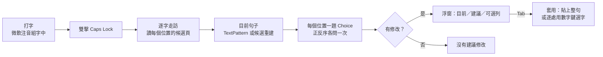

# Jevboard

> 讓微軟注音打完的整句，交給 Jev 重新選字。雙擊 Caps Lock 看建議，按 Tab 套用。

Jevboard 是一個 Windows 常駐小工具（概念驗證，POC）。你照常用微軟注音打一句話，還沒按 Enter 之前連按兩下 Caps Lock，它會自動讀取輸入法在每個位置提供的真實候選字，把整句交給 [Jev](https://docs.typesafe.ai/) 判斷哪些同音字選錯了，在游標旁的浮窗列出建議，確認後一鍵套用。不換輸入法、不改系統設定、不記錄按鍵內容。


```
你打的：想在去一次芮氏        （輸入法自動轉換的結果）
建議：  想【再】去一次【瑞士】  （Jev 依整句語意重選，兩處各 86%、98%）
```

[English summary](#english-summary) ・ [安裝](#安裝) ・ [使用方式](#使用方式) ・ [運作原理](docs/how-it-works.md) ・ [Prompt 設計](docs/prompt-design.md) ・ [評估結果](docs/evaluation.md)

---

## 目錄

- [功能特色](#功能特色)
- [English summary](#english-summary)
- [系統需求](#系統需求)
- [安裝](#安裝)
- [使用方式](#使用方式)
- [運作原理（摘要）](#運作原理摘要)
- [測試與評估](#測試與評估)
- [專案結構](#專案結構)
- [資料、隱私與安全](#資料隱私與安全)
- [已知限制](#已知限制)
- [疑難排解](#疑難排解)
- [專案歷史](#專案歷史)
- [授權](#授權)

## 功能特色

- **保留微軟注音**：不替換輸入法，所有選字最終都是用輸入法自己的候選與數字鍵完成，輸入法的學習照常運作。
- **整句分析**：自動逐字讀取輸入法在每個位置列出的真實候選（含多字詞），每個位置一題 Choice，一次送出；多個錯字會迭代修正，相鄰兩字同時錯也有對策。
- **可控的建議**：高把握的修改預設勾選，次要候選列成「可選」預設不改；建議句直接標出哪些字會換、哪些字可以換；數字鍵切換、Tab 套用、Esc 取消。
- **不搶焦點**：浮窗是不取得焦點的視窗，顯示與點擊都不會離開你正在打字的欄位；任何按鍵、切窗都會立刻取消。
- **跨應用程式**：已在原生 Win32 編輯框與 Chromium／Electron（Edge、VS Code、Obsidian、Claude 桌面版）驗證；候選窗位置靠 UI Automation 事件取得，不依賴螢幕座標。
- **靜態可測**：核心邏輯以錄下的候選頁與 Jev 回應格式做單元測試，另附 111 句同音錯誤評估集，可離線量化 prompt 的效果。

## English summary

**Jevboard** is a Windows tray utility (proof of concept) that keeps Microsoft Bopomofo as the IME and lets [Jev](https://docs.typesafe.ai/) re-pick homophones for a whole uncommitted sentence.

- Type a sentence with Microsoft Bopomofo; before pressing Enter, double-tap **Caps Lock**.
- Jevboard walks the composition with the IME's own navigation keys and reads, through UI Automation, the real candidate page the IME offers at every character (including multi-character words).
- It sends one request to the Jev `/v1/systemone` endpoint with one **Choice** question per position. Every option is the full sentence with that position replaced by a candidate, so the model judges sentences rather than bare characters. Each question is also asked with its options reversed and the two distributions are averaged, which cancels a measured first-option bias of the model.
- Changes that reach ≥ 0.5 probability and at least twice the probability of keeping the sentence are proposed by default; other plausible alternatives are listed switched off. Rounds are iterated while new changes appear, and adjacent-pair variants are tried when nothing passes on its own.
- A non-activating overlay shows the current and proposed sentences; **Tab** applies, **1–9** toggle a row, **Esc** cancels. Applying either pastes the corrected sentence (when the editor exposes the composition through UIA TextPattern) or re-selects each change with the IME's own digit keys, leaving the composition uncommitted.
- Requirements: Windows 10/11 x64, Microsoft Bopomofo, the .NET Framework 4.x C# compiler that ships with Windows (no SDK needed), and a Jev API key. Build with `powershell -NoProfile -ExecutionPolicy Bypass -File build.ps1`; run static tests with `tests\run-tests.ps1`, the live 111-sentence evaluation with `tests\run-tests.ps1 -Live`.
- Status: working POC. Latest evaluation: 100/111 sentences fixed from a wrong homophone, 109/111 left alone when already right. Known weak spots are listed under [已知限制](#已知限制); the design notes in `docs/` are in Chinese.

## 系統需求

| 項目 | 需求 |
|---|---|
| 作業系統 | Windows 10 / 11，x64（實測 Windows 11 26200） |
| 輸入法 | 微軟注音（Windows 內建的「微軟注音」，TSF 版） |
| 執行環境 | .NET Framework 4.8（Windows 10/11 內建） |
| 建置工具 | Windows 內建的 `csc.exe`（`C:\Windows\Microsoft.NET\Framework64\v4.0.30319`），不需安裝 Visual Studio 或 .NET SDK |
| 服務 | Jev API key（[申請與文件](https://docs.typesafe.ai/introduction/quickstart)），模型使用 `jev-latest` |

## 安裝

### 1. 取得原始碼並建置

```bash
git clone <this-repo-url> Jevboard
cd Jevboard
powershell -NoProfile -ExecutionPolicy Bypass -File build.ps1
```

成功時會印出 `bin\Jevboard.exe` 的路徑。建置只用到 Windows 內建的編譯器與組件（WinForms、UIAutomationClient、System.Web.Extensions），沒有 NuGet 相依。

### 2. 啟動與設定

1. 執行 `bin\Jevboard.exe`。程式沒有主視窗，只在系統匣（托盤）顯示圖示；第一次執行若出現 SmartScreen 警告，那是因為執行檔未簽章。
2. 托盤圖示按右鍵 →「設定…」，貼上 Jev API key（輸入時遮罩），勾選「啟用 Caps Lock 雙擊」，按「儲存」。key 以 Windows DPAPI 使用者範圍加密保存，不會寫進日誌。
3. 托盤選單的「啟用」可以隨時暫停／恢復攔截，「結束」關閉程式。程式只允許一個實例。

### 3. 驗證

1. 開記事本、Edge 或任何可打字的地方，切到微軟注音中文模式。
2. 打一句含同音字的話，例如 `我想在去一次瑞士`（不要按 Enter）。
3. 350 ms 內連按兩下 Caps Lock。約一秒內浮窗會出現在候選窗旁邊，列出建議；按 Tab 套用，或 Esc 取消。
4. 沒有反應時，看 `%LOCALAPPDATA%\Jevboard\jevboard.log` 最後幾行，常見原因寫在[疑難排解](#疑難排解)。

### 4. 開機自動啟動（選用）

按 Win+R 輸入 `shell:startup`，在開啟的資料夾放一個指向 `bin\Jevboard.exe` 的捷徑。

### 5. 更新與移除

- 更新：`git pull` 後重新執行 `build.ps1`，先結束托盤裡的舊實例再啟動新的（執行檔在執行中無法覆寫）。
- 移除：從托盤「結束」，刪除 repo 目錄，再刪除 `%LOCALAPPDATA%\Jevboard`（key、啟用旗標、日誌都在這裡）。

## 使用方式

| 按鍵 | 時機 | 效果 |
|---|---|---|
| Caps Lock 連按兩下 | 組字中（還沒按 Enter） | 開始讀取整句並詢問 Jev |
| Tab | 浮窗顯示建議時 | 套用所有勾選的修改 |
| 1–9（主鍵盤或數字鍵盤） | 浮窗顯示建議時 | 切換該列是否套用；同一位置的候選互斥 |
| Esc | 浮窗顯示時 | 關閉浮窗，不改任何字 |
| 其他按鍵、切窗、點別處 | 浮窗顯示或讀取中 | 取消本次，按鍵照常送給輸入法 |
| Caps Lock 單按 | 任何時候 | 350 ms 後照常切換中英（延遲是為了判斷是否雙擊） |

浮窗的讀法：

- **目前**：輸入法目前轉換出來的整句。
- **建議**：會套用的字以藍底標出；有可選替代字但預設不改的位置，原字下方有琥珀色點狀底線、字後標出列號（例如「依²」），所以即使建議句和目前句相同，也看得出哪些字可以換、該按哪個數字鍵。
- **每一列**：數字徽章（實心＝會套用、空心＝可選）、第幾字、原字 → 建議字、Jev 給的機率。
- 標題顯示「Jev 建議修改 N 處，另有 M 個可選」或「Jev 沒有建議修改」。

英數模式也能用：打完英文還留在英數模式時雙擊，程式會先切回中文再開始，結束後停在中文模式。句中夾空白、標點、英文都能正確對位。

## 運作原理（摘要）



1. **攔截熱鍵**：低階鍵盤 hook 判斷雙擊（兩次完整按下／放開、排除 auto-repeat），只在前景有焦點視窗且輸入法是微軟注音時介入；單擊 350 ms 後原樣重播。
2. **找到候選窗**：微軟注音的候選窗在 Windows 沉浸式 IME 的 z-band 裡，`EnumWindows` 等 API 都看不到；程式訂閱 UI Automation 的 StructureChanged 事件，候選窗每次打開都會帶著 HWND 出現。
3. **逐字走訪**：用輸入法自己的鍵（Esc、Home、↓、→、End、←）走過整句，每個位置用三次跨程序 UIA 呼叫讀第 1 頁候選，約 0.1 秒一字；句尾與空白、英文的處理方式見[運作原理](docs/how-it-works.md)。
4. **目前句子**：有 UIA TextPattern 的編輯器（Chromium、Electron、WPF）直接讀游標前的文字；沒有的（原生 EDIT）用各位置候選第 1 項重建。
5. **問 Jev**：一個請求、每個位置一題 Choice，選項是「換了該位置的整句」；正反序各問一次取平均；門檻、迭代、相鄰成對比較、罕見字過濾等規則見 [Prompt 設計](docs/prompt-design.md)。
6. **套用**：目前句子精確可知時 Esc 取消組字、貼上整句；否則逐處重開候選、以字找當下的數字鍵送出。

完整說明與一句話從頭到尾的追蹤範例：[docs/how-it-works.md](docs/how-it-works.md)。

## 測試與評估

全部是靜態測試，不操作鍵盤、不碰輸入法、不開視窗：

```bash
powershell -NoProfile -ExecutionPolicy Bypass -File tests\run-tests.ps1          # 單元測試（約 180 項）
powershell -NoProfile -ExecutionPolicy Bypass -File tests\run-tests.ps1 -Live    # 加跑 111 句線上評估（需要已儲存的 key）
powershell -NoProfile -ExecutionPolicy Bypass -File tests\run-tests.ps1 -Whole   # 只跑整句案例，並印出實際送出的 prompt 與回答
bin\Jevboard.Tests.exe --preview                                                 # 用假資料顯示浮窗 1.5 秒並存成 bin\overlay-preview.png
```

單元測試用錄下的微軟注音候選頁與 Jev 回應格式當 fixture，涵蓋句子重建、題目建構、回應解析、採用規則、迭代、成對比較、數字鍵決策與浮窗文字。評估集的組成、方法、最新結果與已知失敗：[docs/evaluation.md](docs/evaluation.md)。

## 專案結構

```
Jevboard/
├── build.ps1                 建置 bin\Jevboard.exe（csc.exe，不需 SDK）
├── src/
│   ├── Program.cs            托盤、設定、流程控制、題目建構與採用規則
│   ├── Hotkey.cs             低階鍵盤 hook：雙擊判斷、重播、浮窗期間的按鍵攔截
│   ├── Candidates.cs         候選窗定位、逐字走訪、目前句子、套用
│   ├── JevClient.cs          Jev /v1/systemone 的 Choice 請求與回應驗證
│   ├── Overlay.cs            不取得焦點的浮窗（自繪）
│   ├── NativeUia.cs          最小原生 COM IUIAutomation 介面（事件訂閱）
│   └── Native.cs             Win32 P/Invoke
├── tests/
│   ├── JevboardTests.cs      單元測試、線上評估集、浮窗預覽
│   └── run-tests.ps1
├── docs/
│   ├── how-it-works.md       運作原理與完整追蹤範例
│   ├── prompt-design.md      給 Jev 的 prompt 與所有判斷規則
│   ├── evaluation.md         評估方法、結果與已知失敗
│   └── overlay-preview.png
├── diagnostics/              第一階段可行性實驗與證據（保留為歷史紀錄）
└── POC_SPEC.md               原始 POC 規格
```

## 資料、隱私與安全

- **只在你雙擊時讀取**：鍵盤 hook 平時只判斷 Caps Lock 與浮窗期間的按鍵，不記錄你打了什麼。
- **送出的內容**：雙擊當下那一句（輸入法轉換結果）、每個位置的候選字、以及游標前最多 40 字的已定稿文字（當作語境），透過 HTTPS 送到 `api.typesafe.ai`。沒有其他上傳。
- **日誌**：`%LOCALAPPDATA%\Jevboard\jevboard.log` 只記事件、世代序號、候選 id 與機率、視窗 class 名稱，不含 key、句子或候選字。
- **key 保存**：`%LOCALAPPDATA%\Jevboard\key.bin`，Windows DPAPI 使用者範圍加密，只有同一個 Windows 帳號讀得到。
- **注入的按鍵**：所有程式注入的按鍵都帶標記，hook 會放行，不會把自己的按鍵當成你的操作。只有候選清單開著時才送 Esc（清單沒開時 Esc 會整句取消）。
- **貼上套用**會短暫使用剪貼簿，貼上後把原本的文字放回；非文字內容無法還原。

## 已知限制

- **Jev 的判斷有上限**：短句、語境少時機率不穩；專有名詞（羅密歐）、談字本身的句子（「在再不分」）、搭配偏好（出門要「帶」保險套被改成「戴」）會判斷錯。設計上以「高把握才預設改、其餘列為可選」降低傷害，但仍可能提出錯的建議，請看過再按 Tab。
- **只讀第 1 頁候選**（最多 9 個）；正確的字在第 2 頁以後時無法提議。
- **原生 EDIT 的「目前句子」是重建的**：這類欄位讀不到未定稿組字，只能用各位置候選第 1 項拼出來；候選清單依字頻排序、整句轉換依語境，偶爾不一致，手動改過的字也看不到。
- **走訪會讓候選窗逐字閃動**，每字約 0.1 秒，空白、標點、英文的位置各多等約 0.12 秒；讀取中請不要打字。
- **沒有組字時雙擊**會多送一次 ↓（必要時 Home、End）給應用程式。
- **貼上套用會把句子定稿**，輸入法不會從這次修正學習；逐處選字的路徑才保持組字未提交。
- 其他應用程式的相容性以實測為準；已驗證原生 EDIT 與 Chromium／Electron。

## 疑難排解

| 症狀 | 可能原因／處理 |
|---|---|
| 雙擊沒反應 | 看日誌是否有 `caps lock passed through: …`：`IME closed` 表示該視窗沒有開啟輸入法；`keyboard layout 0x0409` 表示目前是英文鍵盤；沒有任何紀錄表示程式沒在跑或未啟用。 |
| 浮窗提示「沒有偵測到注音組字」 | 當時沒有未定稿的組字（已按 Enter），或輸入法在該欄位不提供候選。 |
| 「輸入法還在英數模式」 | 程式送了 Caps Lock 與 Shift 仍切不回中文；手動切到中文再雙擊。 |
| 「AI 暫不可用（http 401）」 | key 無效或過期，到托盤「設定…」重新輸入。 |
| 建議句與目前句不同但你沒打錯 | 原生 EDIT 欄位的「目前」是重建的，可能與實際不同；套用時以字為準，不受影響。 |
| 建置失敗找不到 csc.exe | 需要 Windows 內建的 .NET Framework 4.x（`C:\Windows\Microsoft.NET\Framework64\v4.0.30319\csc.exe`）。 |

## 專案歷史

- `POC_SPEC.md` 是原始規格：單一位置選字、不做整句、不盲送 ↓。實作過程中依實際使用需求改成整句重選、自動開候選、貼上套用等，README 與 `docs/` 描述的是目前的行為。
- `diagnostics/` 是第一階段的可行性實驗：證明外部程式能從微軟注音的候選窗讀到當頁候選、能用數字鍵在原組字位置選字，以及 IMM32／UIA TextEditPattern 在原生 EDIT 讀不到未定稿組字。其中的 `REPORT.md`、`evidence/` 保留為證據，實驗程式與編譯好的小工具也一併保留。

## 授權

[MIT](LICENSE)。Jev 與 Microsoft Bopomofo 各為其所有者的產品，本專案與其無關。
